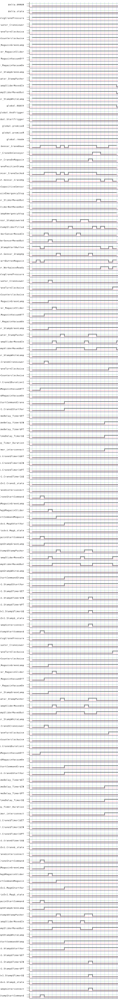

smvtools
========

Visualize the Traces of NuSMV and NuXMV

## Getting started

    pip install git+http://github.com/wadoon/smvtools

## Tools

Input sequence:

| SensorA | SensorB | SensorC |
| ------- | ------- | ------- |
| true    | false   | true    |
| false   | false   | true    |
| true    | false   | false   |
| true    | false   | true    |
| true    | true    | true    |

### Timing Diagram Visualization

You can create SVG images from input sequences with `tdviz`.

    tdviz share/test.csv

# License

smvtools -- Tools around NuSMV and NuXMV
Copyright (C) 2014-2016 - Alexander Weigl

This program is free software; you can redistribute it and/or modify it under the terms of the GNU General Public License as published by the Free Software Foundation; either version 3 of the License, or (at your option) any later version.

This program is distributed in the hope that it will be useful, but WITHOUT ANY WARRANTY; without even the implied warranty of MERCHANTABILITY or FITNESS FOR A PARTICULAR PURPOSE.  See the GNU General Public License for more details.

You should have received a copy of the GNU General Public License along with this program; if not, write to the Free Software Foundation, Inc., 51 Franklin Street, Fifth Floor, Boston, MA 02110-1301  USA
